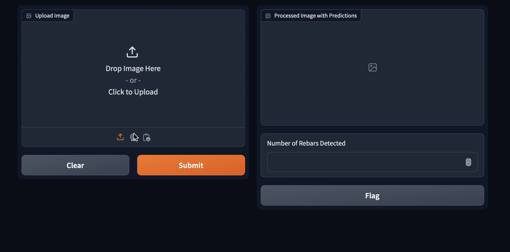
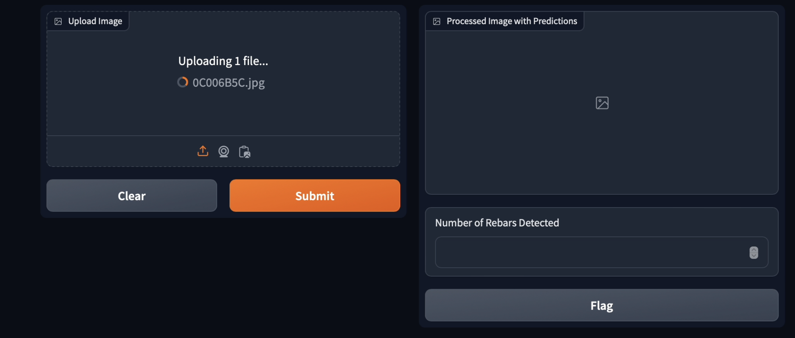
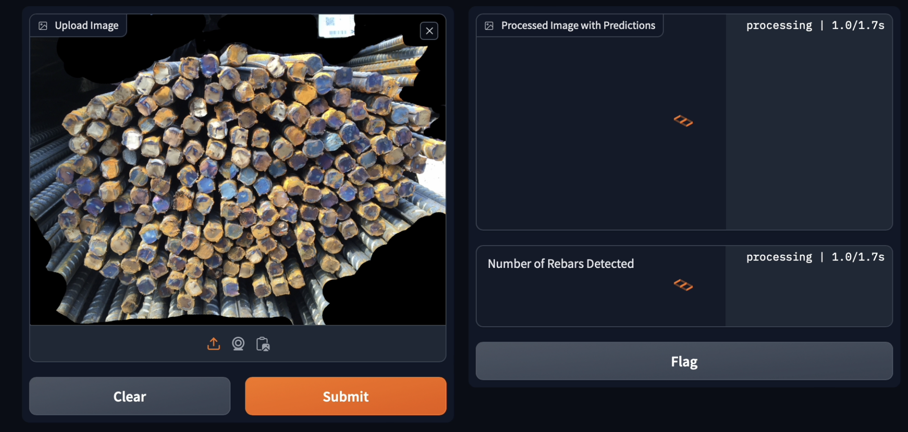
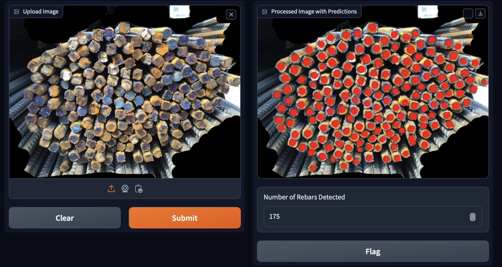
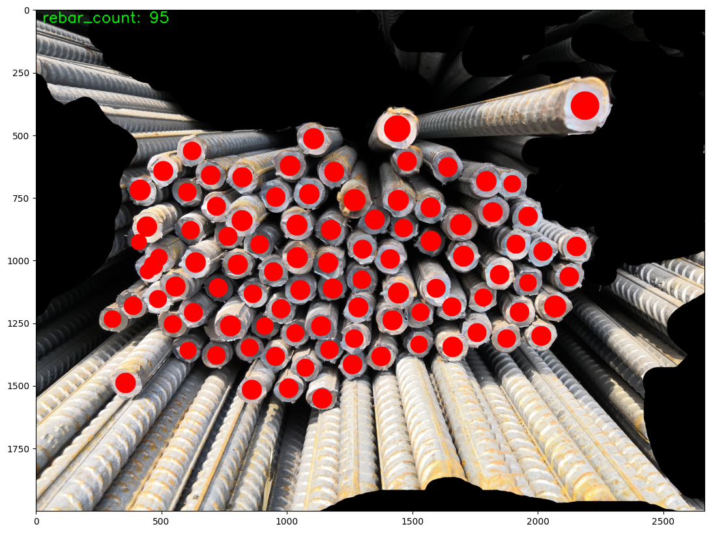
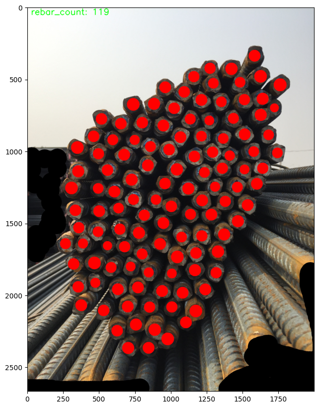
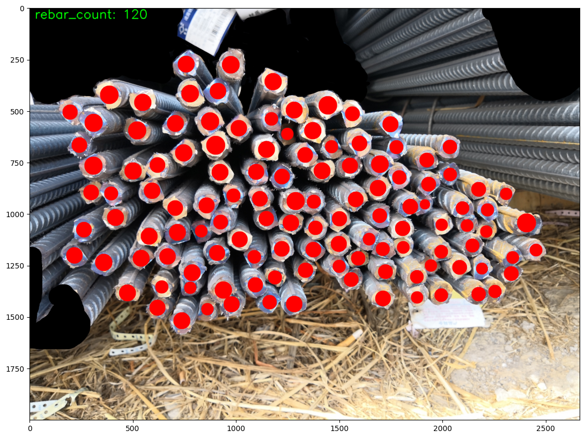

# Rebar Count

## Overview
Rebar Count is a computer vision project designed to detect and count rebar in construction images. The project leverages Faster R-CNN based models and uses Python for data processing, evaluation, and deployment. The output images show the detected rebar with bounding boxes and the total count.

## Project Structure
The project directory is organized as follows:

```

Rebar_Count/
│
├── notebooks/                    
│   └── Rebar_Count.ipynb
│
├── src/                         
│   ├── __init__.py               
│   ├── engine.py                 
│   ├── gradio_app.py             
│   ├── transforms.py             
│   ├── utils.py                  
│   ├── evaluation/               
│   │   ├── coco_eval.py          
│   │   └── coco_utils.py         
│   └── data/                     
│       └── import_data.py       
│
├── data/                         
│   ├── demo/                     
│   │   ├── 1.png
│   │   ├── 2.png
│   │   ├── 3.png
│   │   └── 4.png
│   └── tests/                    
│       └── 0C006B5C.jpg
│
├── results/                      
│   ├── Unknown.png
│   ├── Unknown_2.png
│   ├── Unknown_3.png
│   └── Unknown_4.png
│
├── requirements.txt              
├── README.md                     
└── LICENSE                       

```

## Requirements
The project requires the following Python libraries. You can install them using `pip`:

```bash
pip install -r Requirements.txt
```

The key dependencies include:

- PyTorch
- Faster R-CNN
- OpenCV
- Gradio

## Installation

1. Clone the repository:

   ```bash
   git https://github.com/A7medM0sta/Rebar_Count.git
   ```

2. Navigate to the project directory:

   ```bash
   cd Rebar_Count
   ```

3. Install the required dependencies:

   ```bash
   pip install -r Requirements.txt
   ```

## Usage

### Running the Jupyter Notebook

To explore and test the model, open the `Rebar_Count.ipynb` notebook in Jupyter:

```bash
jupyter notebook Rebar_Count.ipynb
```


### Gradio Interface

To launch the Gradio interface for a user-friendly web application, run the `gradio.py` script:

```bash
python gradio.py
```

## Results
The results from running the model are saved in the `Results/` directory. Each image is processed and saved with detected rebar highlighted by bounding boxes and the count displayed.
### some key results are shown below:

<p align="center">
  <figure>
    <figcaption>Step 1</figcaption>
    
  </figure>
  <figure>
    <figcaption>Step 2</figcaption>
    
  </figure>
  <figure>
    <figcaption>Step 3</figcaption>
    
  </figure>
  <figure>
    <figcaption>Step 4</figcaption>
    
  </figure>
</p>

Here are the demo images used for testing:

<p align="center">
  
  
  
  
</p>


## Testing
To test the model on sample images, place your images in the gradio up just upload your image

## Future Work

- Improving the accuracy of rebar detection by experimenting with different models and techniques.
- Expanding the project to detect other construction materials and objects.
- Optimizing the Gradio interface for better user experience.
